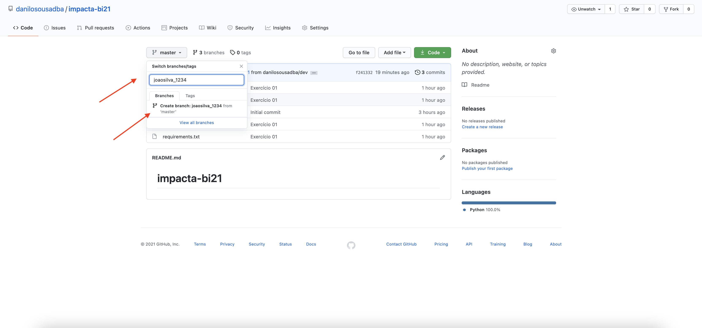

# impacta-bi21

## Exercício 01

Objetivo do curso é fazer com que a turma consiga trabalhar no mesmo projeto no GitHub

Foi desenvolvido um script em Python [bi21.py](bi21.py) que irá ler os arquivos que estarão no diretório [grupos](grupos) e irá printar na tela o nome, ra e grupo dos alunos.

Com base nesse print os alunos receberão as notas.

Cada grupo deverá criar sua propria branch com o nome do grupo EX: "grupo1" um arquivo com o nome do grupo com o seguinte nome "grupo1.txt" e com o layout de um csv como no exemplo abaixo

* Cada aluno deverá criar sua branch com o nome_ra . EX: joaosilva_1234,mariaduarte_4221,josepassos_12345
```
git clone https://github.com/danilosousadba/impacta-bi21.git
git branch -b joaosilva_1234
```
OU DIRETAMENTE PELO SITE


  
  
* Cada aluno deverá criar um arquivo com o nome com a extensão txt. Ex. joaosilva.txt, mariaduarte.txt, josepassos.txt" com as informações "nome","ra","grupo" conforme exemplo abaixo

joaosilva.txt
```
nome,ra,grupo
joaosilva,1234,1
```

```
git status
```
<i>resultado</i>
```
On branch joaosilva_1234
Untracked files:
  (use "git add <file>..." to include in what will be committed)
        grupos/joaosilva_1234.txt
```


```
git add grupos/joaosilva_1234.txt
```

```
git commit -m "Commit Joao Silva"
```
```
git push origin joaosilva_1234
```

Agora o aluno deverá solicitar o pull request para a master


